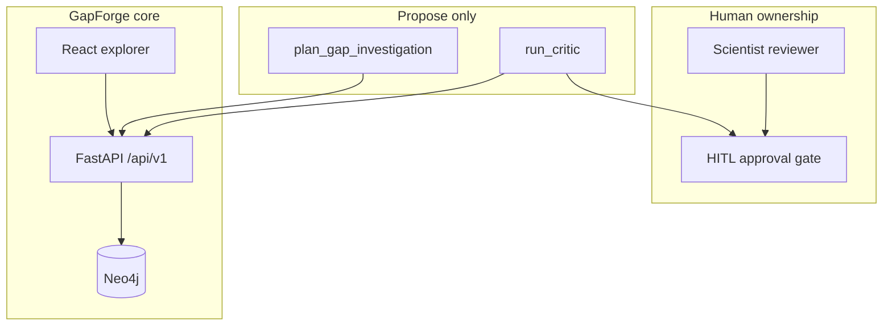

# GapForge

**Open-source translational gap hunter** for stalled or failed-but-promising drug programs.

Agents **propose**. Humans **dispose**. Not a molecule generator. Not clinical decision support.

[](LICENSE)
[](api/requirements.txt)
[](docker-compose.yml)

> **Context of Use:** GapForge assembles literature- and graph-backed *gap hypotheses* for scientific discussion. It is **not** for clinical care, prescribing, regulatory submission evidence, or synthesis planning.

---

## Why GapForge

Most clinical candidates fail (~85–90%). AI has accelerated molecule discovery but has not fixed translation. GapForge focuses on the harder question:

> *This program looked promising and stalled — what are the plausible scientific gaps, and what should we check next?*

| We do | We do not |
|-------|-----------|
| Evidence assembly across trials, literature, and target–disease graphs | Autonomous molecule design |
| Gap taxonomy (efficacy, biomarker, endpoint, PK, safety, …) | Patient treatment recommendations |
| Hypothesis cards with citations + adversarial critic | Auto-approving high-stakes claims |
| Mandatory human review (HITL) before “team conclusions” | Claiming regulatory-grade credibility without validation |

Design details: [docs/GAPFORGE.md](docs/GAPFORGE.md) · HITL: [docs/HUMAN_IN_THE_LOOP.md](docs/HUMAN_IN_THE_LOOP.md)

---

## Risk tiers

| Tier | Capability | Policy |
|------|------------|--------|
| **L0** | Read-only graph / program explore | Auto-allowed |
| **L1** | Summaries with citations | Auto + spot check |
| **L2** | Gap hypotheses / next experiments | **HITL required** |
| **L3** | Chemistry generation, dosing, patient advice | **Blocked** (v1) |

---

## Quick start

**Prerequisites:** [Docker Desktop](https://www.docker.com/products/docker-desktop/), Python 3.11+, Node.js 20+.

```bash
git clone https://github.com/LordKay-sudo/gapforge.git
cd gapforge
cp .env.example .env

docker compose up --build
```

| Service | URL |
|---------|-----|
| **Web UI** | http://localhost:8080 |
| **GapForge programs** | http://localhost:8080/programs |
| **HITL review queue** | http://localhost:8080/gaps/review |
| API docs | http://localhost:8000/docs |
| Neo4j Browser | http://localhost:7474 (`neo4j` / `changeme`) |

### Demo case study

**Flurizan (tarenflurbil) — Alzheimer Phase 3 efficacy miss** (educational historical framing).

1. Open **GapForge** → Flurizan AD program  
2. Inspect trials, taxonomy, and L2 hypothesis cards  
3. Open **Review** → run critic → approve / reject / request more  
4. Export review bundle — only **approved** cards become team conclusions  

Seed data: [`data/gapforge/flurizan_case.json`](data/gapforge/flurizan_case.json)

---

## Architecture



Built on a disease–target knowledge graph (Open Targets–style associations) with GapForge program/trial/hypothesis nodes and PROV-style `SUPPORTED_BY` / `CONTRADICTED_BY` edges.

---

## Ecosystem

GapForge is the **product name** for this repo. Related open components:

| Repository | Role |
|------------|------|
| **[gapforge](https://github.com/LordKay-sudo/gapforge)** (this repo) | Graph + GapForge API/UI + Flurizan case study |
| [kg-rag-demo](https://github.com/LordKay-sudo/kg-rag-demo) | Citation-grounded literature / ClinicalTrials RAG |
| [embabel-mcp](https://github.com/LordKay-sudo/embabel-mcp) | MCP tools + `research_program_gaps` agent |
| [peerlens](https://github.com/LordKay-sudo/peerlens) | Paper quality signals (retraction / concern filter) |
| [bioinsight-graph](https://github.com/LordKay-sudo/bioinsight-graph) | Upstream disease–target graph lineage |

Docs: [docs/ECOSYSTEM.md](docs/ECOSYSTEM.md) · MCP tools: `plan_gap_investigation`, `build_program_dossier`, `propose_gap_hypotheses`, `run_critic`, `export_review_bundle`.

---

## API (GapForge)

| Method | Path | Notes |
|--------|------|--------|
| `GET` | `/api/v1/programs` | List stalled programs |
| `GET` | `/api/v1/programs/{id}/dossier` | L1 dossier |
| `GET` | `/api/v1/gaps` | Hypothesis cards |
| `POST` | `/api/v1/gaps/{id}/critic` | Adversarial critic |
| `GET` | `/api/v1/reviews/queue` | HITL queue |
| `POST` | `/api/v1/reviews/{gap_id}` | approve / reject / request_more |
| `GET` | `/api/v1/export/review-bundle` | Provenance export |

---

## Safety posture

Aligned with [FDA/EMA Guiding Principles of Good AI Practice in Drug Development](https://www.fda.gov/about-fda/artificial-intelligence-drug-development/guiding-principles-good-ai-practice-drug-development): human-centric design, clear context of use, risk-based controls, data provenance, and reviewable outputs.

- Associations are **correlative**, not causal  
- Predictions (if added later) are labeled `model_estimate` and never auto-written as facts  
- Literature informs RAG; only curated ETL writes the main Neo4j fact graph  

See [PROVENANCE.md](PROVENANCE.md).

---

## Development

```bash
# API tests
cd api && py -3 -m venv .venv
.\.venv\Scripts\pip install -r requirements.txt pytest
.\.venv\Scripts\python -m pytest -q

# Web
cd web && npm install && npm run build
```

Docs: [GETTING_STARTED.md](docs/GETTING_STARTED.md) · [ARCHITECTURE.md](docs/ARCHITECTURE.md) · [ROADMAP.md](docs/ROADMAP.md)

---

## License

[MIT](LICENSE) © 2026 LordKay-sudo

Upstream Open Targets–style data: see licence notes in [PROVENANCE.md](PROVENANCE.md) (typically CC0 for platform data — always verify for your release).
