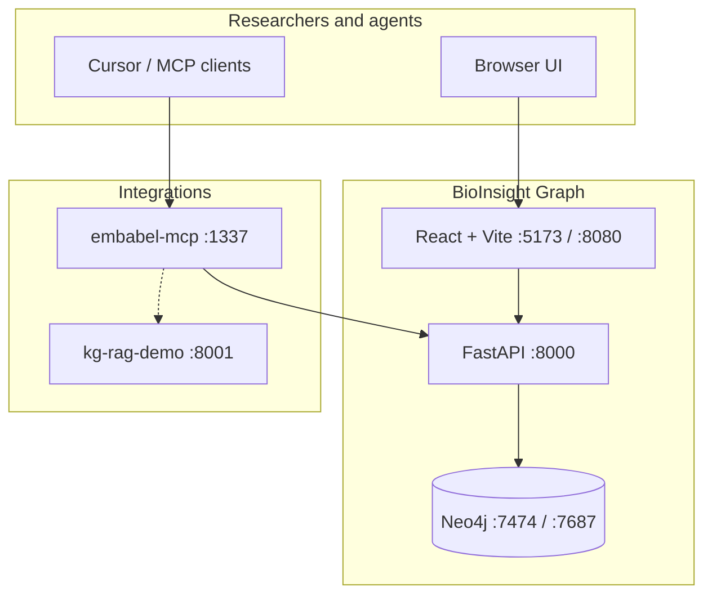
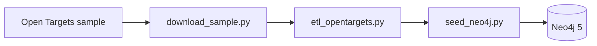
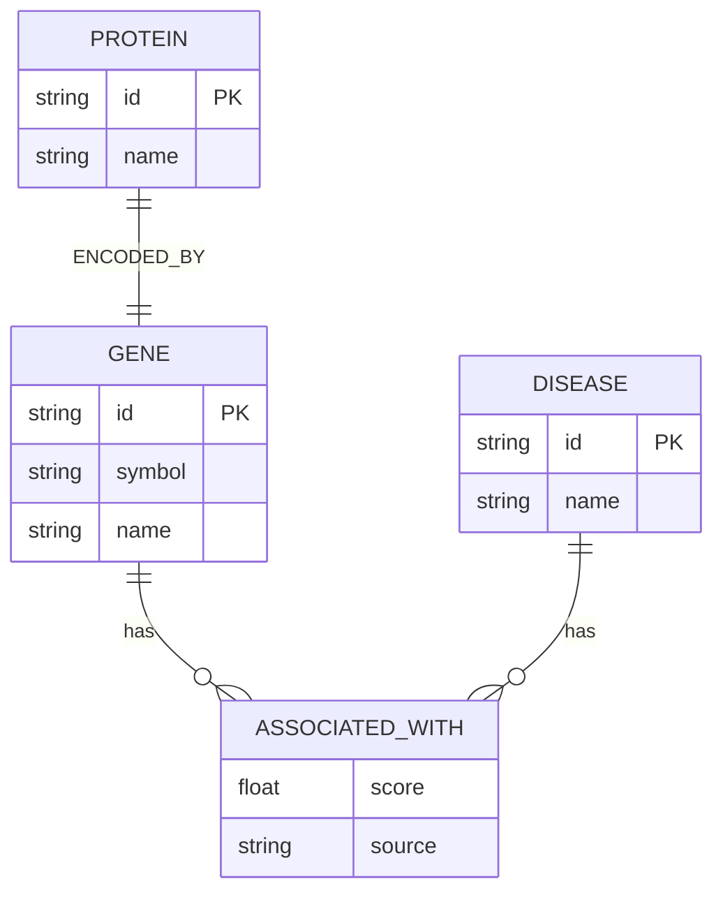

# BioInsight Graph — architecture reference

This document supplements the [README](../README.md). The **application code is unchanged** here — only diagrams and URLs for demos. Cross-repo improvement plan: [PORTFOLIO_ROADMAP.md](./PORTFOLIO_ROADMAP.md).

## System context

## Data pipeline (unchanged)

## Entity–relationship model (ERD)

## Browser endpoints

| What | URL | Credentials |
|------|-----|-------------|
| Search UI (Docker) | http://localhost:8080 | — |
| Search UI (dev) | http://localhost:5173 | — |
| API Swagger | http://localhost:8000/docs | — |
| Neo4j Browser | http://localhost:7474 | `neo4j` / `changeme` |
| Gene detail example | http://localhost:8080/gene/{gene_id} | — |
| MCP SSE (optional) | http://localhost:1337/sse | — |

Replace `{gene_id}` with an Ensembl id from search (e.g. after searching BRCA1).

## UI screenshots (repository assets)

| Asset | Description |
|-------|-------------|
| [screenshot-search.png](screenshot-search.png) | Tabbed gene/disease search |
| [screenshot-graph.png](screenshot-graph.png) | Force-directed 1-hop subgraph |
| [screenshot-gene-detail.png](screenshot-gene-detail.png) | Full gene page with stats + graph |

See [DEMO.md](DEMO.md) for recording a walkthrough GIF without changing the app.
