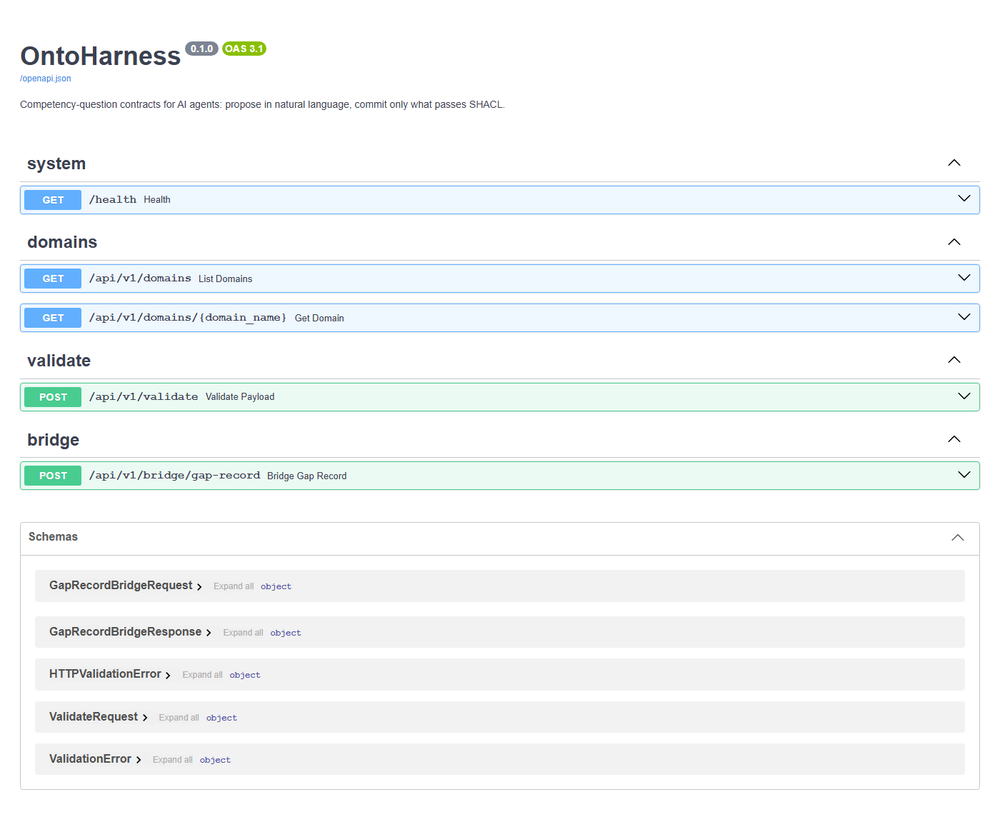
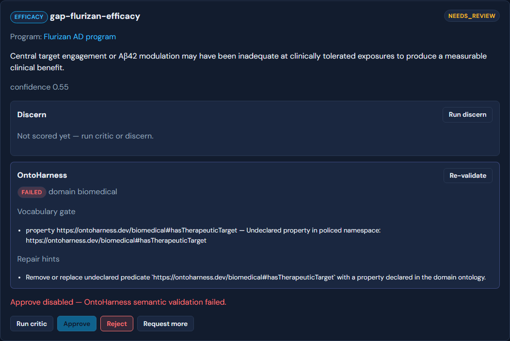
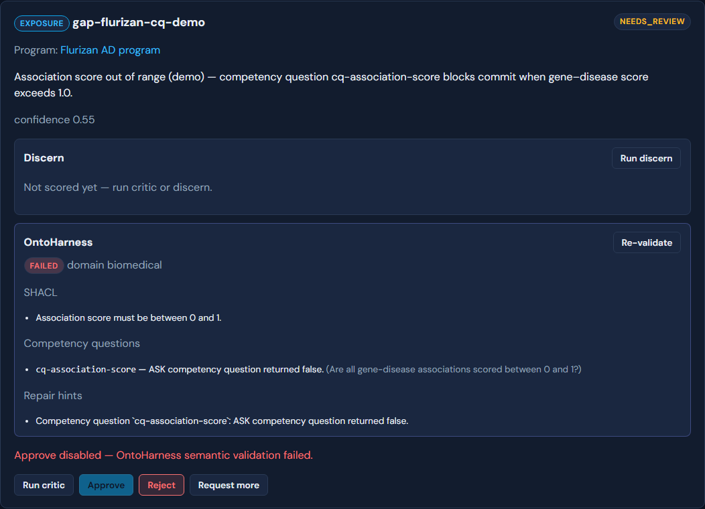
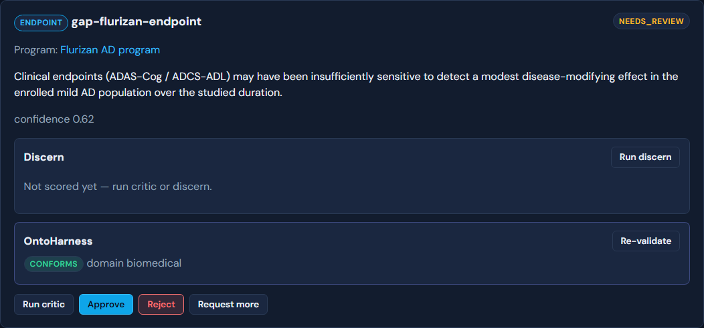

# End-to-end demo: GapForge + OntoHarness + Embabel MCP

One reproducible path from **docker compose up** → **agent proposes** → **semantic gate** → **human approves** → **RDF export**.

**Repos (sibling layout):**

```
OSS/
├── gapforge/
├── ontoharness/
└── embabel-mcp/
```

---

## 1. Start the full stack

```bash
cd gapforge
cp .env.example .env
# Edit .env — set OPENAI_API_KEY (OpenRouter or OpenAI)

# Option A — compose file
docker compose -f docker-compose.full.yml up --build

# Option B — helper script
./scripts/up-full-stack.sh          # macOS/Linux
.\scripts\up-full-stack.ps1         # Windows
```

First boot takes several minutes (Neo4j health → seed → API → OntoHarness → MCP).

| Service | URL |
|---------|-----|
| GapForge UI | http://localhost:8080 |
| HITL review queue | http://localhost:8080/gaps/review |
| GapForge API | http://localhost:8000/docs |
| OntoHarness API | http://localhost:8010/docs |
| Embabel MCP (SSE) | http://localhost:1337/sse |
| Neo4j Browser | http://localhost:7474 (`neo4j` / `changeme`) |

---

## 2. Verify services

```bash
curl -s http://localhost:8000/api/v1/health
curl -s http://localhost:8010/health
curl -s http://localhost:8000/api/v1/programs | head
```

List Flurizan gaps (seeded on first run):

```bash
curl -s "http://localhost:8000/api/v1/gaps?program_id=prog-flurizan-ad"
```

`gap-flurizan-efficacy` ships with a **canned OntoHarness failure** (`hasTherapeuticTarget`) for demo in the review UI.

---

## 3. Agent workflow (MCP tools)

Connect Cursor (or MCP Inspector) to `http://localhost:1337/sse`.

Recommended sequence for program `prog-flurizan-ad`:

| Step | MCP tool | Purpose |
|------|----------|---------|
| 1 | `plan_gap_investigation` | COU + L2 tool plan |
| 2 | `build_program_dossier` | Trials, genes, existing gaps |
| 3 | `propose_gap_hypotheses` `create=false` | List L2 cards (no auto-approve) |
| 4 | `run_critic` | Adversarial pass on a gap id |
| 5 | `run_gap_discern` | Persist Discern gate on gap |
| 6 | `run_gap_ontology_validate` | Neo4j → Turtle → OntoHarness; persist result |
| 7 | **Human** | Open http://localhost:8080/gaps/review — approve/reject |
| 8 | `export_review_bundle` | JSON provenance bundle |
| 9 | `export_approved_rdf` | Turtle snapshots from approved gaps |

Example (after MCP connected):

```
build_program_dossier programId="prog-flurizan-ad" format=markdown
run_gap_ontology_validate gapId="gap-flurizan-endpoint"
```

OntoHarness-only tools (sidecar on `:8010`):

```
validate_proposal          # raw Turtle
bridge_gap_record          # GapForge JSON → Turtle + SHACL
get_repair_hints
list_ontoharness_domains
```

---

## 4. Human review (HITL)

1. Open http://localhost:8080/gaps/review  
2. Select **gap-flurizan-efficacy** — OntoHarness panel shows `conforms: false` (fabricated predicate demo)  
3. Select **gap-flurizan-cq-demo** — competency question `cq-association-score` fails (score > 1.0, v0.6)  
4. Select **gap-flurizan-endpoint** — run **Re-validate** if needed; approve when green  
5. Approve is **blocked** if OntoHarness or Discern fails (422 from API)

---

## 5. Export approved RDF

After approving at least one gap:

```bash
# Single gap
curl -s "http://localhost:8000/api/v1/export/approved-rdf?gap_id=gap-flurizan-endpoint"

# Whole program
curl -s "http://localhost:8000/api/v1/export/approved-rdf?program_id=prog-flurizan-ad"
```

Via MCP:

```
export_approved_rdf program_id="prog-flurizan-ad" format=markdown
```

Response is Turtle with `bio:Hypothesis`, `bio:supports`, `bio:approvedAt`, etc.

---

## 6. Curl-only OntoHarness demo (no MCP)

With stack running:

```bash
cd ../ontoharness
./.venv/Scripts/python examples/validate_demo.py   # Windows
# python examples/validate_demo.py                   # macOS/Linux
```

Or bridge a gap record:

```bash
curl -s -X POST http://localhost:8010/api/v1/bridge/gap-record \
  -H "Content-Type: application/json" \
  -d '{"record":{"id":"gap-1","claim":"Endpoint gap","confidence":0.6,"genes":[{"id":"ENSG1","symbol":"BRCA1"}],"disease":{"id":"MONDO:1","name":"AD"}}}'
```

---

## Environment (full stack)

Set in `gapforge/.env`:

| Variable | Full-stack value |
|----------|------------------|
| `OPENAI_API_KEY` | Required for MCP |
| `OPENAI_BASE_URL` | `https://openrouter.ai` (optional) |
| `ONTOHARNESS_*` | Set automatically by `docker-compose.full.yml` on API + MCP |

GapForge API (compose overrides):

- `ONTOHARNESS_ENABLED=true`
- `ONTOHARNESS_BASE_URL=http://ontoharness:8010`
- `ONTOHARNESS_FAIL_OPEN=false`

Embabel MCP (compose overrides):

- `ONTOHARNESS_ENABLED=true`
- `ONTOHARNESS_API_BASE_URL=http://ontoharness:8010`

---

## Troubleshooting

| Issue | Fix |
|-------|-----|
| `build context ../ontoharness` fails | Clone ontoharness next to gapforge |
| MCP won't start | Set `OPENAI_API_KEY` in `.env` |
| All proposes return 422 OntoHarness | Sidecar not healthy — `curl localhost:8010/health` |
| No gaps in UI | Wait for seed job; check `docker compose logs seed` |
| Approve blocked | Fix OntoHarness/Discern in review panel first |

---

## 7. Recorded outputs (no Docker)

Terminal and API captures live in [demo-recordings/](./demo-recordings/). **Capture order:** UI screenshots first (Playwright), then `record_demo_outputs.py` (which approves `gap-flurizan-endpoint` for the export trail).

```bash
# Stack on :8080 / :8000 / :8010
node scripts/capture_ontoharness_demo.mjs
node scripts/capture_demo_walkthrough.mjs
ONTOHARNESS_BASE_URL=http://localhost:8010 python scripts/record_demo_outputs.py
```

Curl-only OntoHarness (no GapForge stack):

```bash
cd ../ontoharness && python -m uvicorn api.app.main:app --port 8011
cd gapforge && ONTOHARNESS_BASE_URL=http://localhost:8011 python scripts/record_demo_outputs.py
```









Review UI captures: live Docker (`node scripts/capture_ontoharness_demo.mjs`) or static fallback [review-ui-capture.html](./demo-recordings/review-ui-capture.html).

**Walkthrough video:** [demo-walkthrough.webm](./demo-recordings/demo-walkthrough.webm) (Swagger → review queue scroll through efficacy, CQ, and endpoint gaps).

**v0.6 terminal trail:** `05-competency-score.json` → `06-ontology-validate-endpoint.json` → `07-approve-endpoint.json` → `08-export-approved-rdf.ttl`.

---

- [demo-recordings/](./demo-recordings/) — **recorded terminal outputs + Swagger screenshot** (run without full Docker)
- [PLATFORM.md](./PLATFORM.md) — base services and ports  
- [HUMAN_IN_THE_LOOP.md](./HUMAN_IN_THE_LOOP.md) — L2 policy  
- [OntoHarness validate_demo](https://github.com/LordKay-sudo/ontoharness/blob/main/examples/validate_demo.py)  
- [embabel-mcp README](https://github.com/LordKay-sudo/embabel-mcp/blob/main/README.md)
