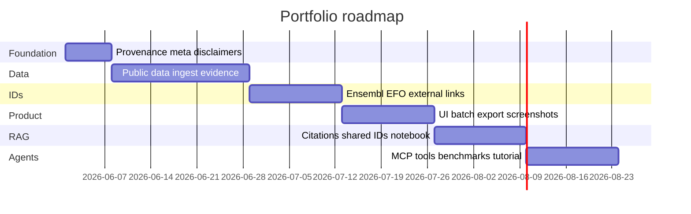

# Portfolio improvement roadmap

Generic strengthening plan for the **BioInsight Graph** platform and related repos (**kg-rag-demo**, **embabel-mcp**). Aims at the same bar as production biodata platforms: credible public data, stable identifiers, provenance, and clear scientific limits.

**Positioning:** A full-stack **disease–target knowledge graph** with API, UI, literature RAG, and optional MCP — built on public biomedical data standards, not a replacement for production genome browsers or target platforms.

**Per-repo execution roadmaps:** [bioinsight ROADMAP](./ROADMAP.md) · [embabel-mcp](https://github.com/LordKay-sudo/embabel-mcp/blob/main/docs/ROADMAP.md) · [kg-rag-demo](https://github.com/LordKay-sudo/kg-rag-demo/blob/main/docs/ROADMAP.md)  
**Compact session handoff:** [ECOSYSTEM_CONTEXT.md](./ECOSYSTEM_CONTEXT.md)

---

## Typical audiences

| Domain | What they expect from a graph platform like this |
|--------|--------------------------------------------------|
| **Bioinformatics / reference data** | Open datasets, stable IDs, reproducible pipelines, training-friendly APIs |
| **Target discovery / pharma R&D** | Disease–target evidence, scores, compare targets, export for analysts |
| **Health informatics** | Reliable services, provenance, human review, clear non-clinical boundaries |
| **Platform / backend engineering** | Graph model, Docker, CI, versioning, batch endpoints |
| **Agent / developer tooling** | Documented APIs exposed as MCP tools with audit trails |

One roadmap covers all of the above — no per-organization variants required.

---

## What “strong” looks like in this domain

| Capability | Why it matters |
|------------|-------------------|
| **Real public datasets** | Shows you can ingest and model industry-standard sources, not only demos |
| **Stable identifiers** | Ensembl gene IDs, disease ontologies (EFO/MONDO) — composable with other tools |
| **Evidence, not just edges** | Multiple evidence types and sources per association — how real target platforms work |
| **Release provenance** | `data_version`, licence, citation — reproducible science and engineering |
| **Association ≠ causation** | Clear limits; no implied diagnostics or treatment advice |
| **API + UI parity** | Every impressive backend feature visible in the product |
| **Structured + unstructured** | Graph associations plus cited literature (two repos, one story) |
| **Human-in-the-loop** | Review workflow before trusting agent output |
| **Quick-start tutorials** | Notebook or walkthrough: download → graph → query in &lt; 15 minutes |
| **Planned retrieval (not static RAG)** | Decompose questions; adapt tool/API hops; fuse graph + cited literature |

---

## Beyond GraphRAG (design direction)

GraphRAG improved naive RAG; production biodata agents still need **reasoning-shaped retrieval**:

| Theme | In this ecosystem (not a PRoH fork) |
|-------|--------------------------------------|
| Higher-order facts | **Evidence bundles** on associations (type, source, score) — “hyperedge-like” without a hypergraph DB |
| **Ontology-guided structure** | Typed entities/relations + EFO/MONDO/ENSG — curated ingest on BioInsight; schema-guided extract on kg-rag ([UniAI-GraphRAG](https://arxiv.org/html/2603.25152v3), production ontology posts) |
| Dynamic planning | MCP **plan → execute → replan**; conditional graph before literature |
| **Dual-channel retrieval** | Local graph hops (API/dossier) + cited document chunks (kg-rag) — not full MS GraphRAG community reports on a tiny graph |
| Provenance | `/meta`, dossier footers, export bundles, HITL vs UI |
| Honest limits | Association ≠ causation; demo data disclaimers |

Reference architectures only — implement via [ROADMAP](./ROADMAP.md) task IDs: [PRoH](https://github.com/zaixjun/PRoH), [UniAI-GraphRAG](https://arxiv.org/abs/2603.25152). Do **not** import those codebases or replace Open Targets ingest with schema-free LLM graph building.

### Ontology-first vs LLM-built (main graph)

| Approach | Use in this portfolio |
|----------|------------------------|
| **Curated public data + ontology IDs** | **BioInsight** — source of truth for target–disease evidence |
| **LLM extract → normalize → Neo4j** | **kg-rag-demo** only — literature demo ([ML6 biomedical KG](https://blog.ml6.eu/accelerating-biomedical-knowledge-graph-construction-with-llms-db429952f4b2)) |
| **LangChain GraphRAG tutorial stack** | Optional reading ([Towards AI + Neo4j](https://pub.towardsai.net/graphrag-explained-building-knowledge-grounded-llm-systems-with-neo4j-and-langchain-017a1820763e)); not a required dependency |

---

## Current stack (baseline)

| Repository | Role |
|------------|------|
| **bioinsight-graph** | Primary app: ETL → Neo4j → FastAPI → React (search, gene detail, force-directed graph) |
| **kg-rag-demo** | Documents → graph + vectors → citation-grounded Q&A |
| **embabel-mcp** | MCP tools on BioInsight `/api/v1` (+ optional kg-rag bridge) |

**Strengths today**

- End-to-end graph application with polished UI and screenshots/GIF
- Ranked disease–target queries, gene comparison API
- Docker Compose, CI, architecture docs, HITL documentation
- MCP tools, resources, prompts, and `research_gene` agent

**Gaps to close for production-grade credibility**

- Small demo graph vs credible public-data ingest
- Single association score vs evidence decomposition
- Limited cross-links to canonical databases
- Literature and structured graph not fully aligned on IDs
- Few “clone and run” tutorials for new contributors

---

## Improvements by repository

### BioInsight Graph (highest leverage)

#### 1. Production-shaped public data ingest

**Today:** Small Open Targets–*style* sample.  
**Target:** Defensible slice of a real [Open Targets Platform](https://platform.opentargets.org/) release (or equivalent open association corpus).

| Task | Outcome |
|------|---------|
| Ingest via **bulk download or warehouse export** (not thousands of single-entity API calls) | Scalable ETL story |
| Store `evidence_type`, `source`, `score` per association | Richer graph model |
| Record `data_version`, `release_date`, licence | Provenance |

#### 2. Identifier hygiene

- Genes: **ENSG** with validation and links to [Ensembl](https://www.ensembl.org/).
- Diseases: **EFO / MONDO** ids and labels.
- API: `GET /genes/{id}/external-links` (Ensembl, Open Targets, UniProt).

#### 3. Honest scientific scope

- Model and UI: **associations are correlative**.
- Docs: explicit non-goals (diagnosis, treatment decisions, causal claims).
- Complements [HUMAN_IN_THE_LOOP.md](./HUMAN_IN_THE_LOOP.md).

#### 4. API depth (beyond CRUD search)

| Feature | Signal |
|---------|------------------|
| `GET /meta` | Version, sources, disclaimer |
| `POST /genes/batch-lookup` | Throughput |
| `GET /export/gene-report` | Analyst-friendly export with provenance columns |
| Stable OpenAPI + `/api/v1` versioning | Maintainable public API |

#### 5. UI — keep graphs, add analyst depth

Do **not** remove force-directed views or search UX. Add:

- Evidence breakdown per disease (stacked by type)
- Disease-centric page: top targets for a condition
- Compare genes page (wire existing compare API)
- Data version chip in header/footer

---

### kg-rag-demo

| Task | Outcome |
|------|---------|
| PMIDs / DOI / Europe PMC links on citations | Trustworthy literature chain |
| Same **ENSG / EFO** resolution as BioInsight | One platform story |
| Document + notebook: structured graph + RAG for one gene | Multimodal evidence demo |
| Extraction provenance (chunk id, confidence) | Transparent pipeline |
| **`docs/EXTRACTION_SCHEMA.md`** — allowed entity/relation types (ontology-guided extract) | Less noisy triples than open IE |
| **Normalization step** after extract (synonyms, duplicates) | ML6 uniformisation pattern |

---

### embabel-mcp

| Task | Outcome |
|------|---------|
| Tools return `data_version` and canonical URLs | Provenance in agent workflows |
| `resolve_identifier`, `get_target_evidence` | Beyond thin JSON proxy |
| `export_provenance_bundle` | Auditable export bundle (sources, versions, links) |
| **`graph-and-literature` as dual-channel** — dossier first; kg-rag only if needed | UniAI-style local + document fusion |
| Prompt: step-by-step “public data → local API → MCP” | Runnable without reading Java internals |
| HITL remains default-off for MCP; UI is ground truth | Sensible production split |

---

## What not to claim (in docs or demos)

- Replacing Ensembl, gnomAD, Open Targets Platform, or clinical pipelines
- Regulatory-grade diagnostics or treatment recommendations
- “AI found causal targets” from association scores alone
- Huge agent features without versioned, citable data underneath

---

## Phased roadmap

Sequential phases (~12 weeks). Adjust dates to your schedule; phases 4 and 5 can overlap.

### Phase 0 — Trust and provenance (week 1)

| ID | Task | Repo | Status |
|----|------|------|--------|
| 0.1 | `PROVENANCE.md` — licences, citations, data version, disclaimers | bioinsight-graph | ✓ |
| 0.2 | `GET /meta` | bioinsight-graph | ✓ |
| 0.3 | UI: version + disclaimer on main pages | bioinsight-graph | ✓ |
| 0.4 | README section: associations vs causation | bioinsight-graph | ✓ |

**Done when:** Every API consumer can read version + limits without reading code.

---

### Phase 1 — Real association data (weeks 2–4)

| ID | Task | Repo |
|----|------|------|
| 1.1 | Choose ingest source (OT download / BigQuery / FTP) and document it | bioinsight-graph |
| 1.2 | Neo4j schema: evidence fields on relationships | bioinsight-graph |
| 1.3 | ETL v2 — hundreds+ genes, thousands+ associations | bioinsight-graph |
| 1.4 | API returns evidence breakdown on ranked endpoints | bioinsight-graph |
| 1.5 | CI fixtures from frozen subset | bioinsight-graph |

**Done when:** Stats endpoint reflects a credible graph; BRCA1 shows multiple evidence types.

---

### Phase 2 — Interoperability (weeks 5–6)

| ID | Task | Repo |
|----|------|------|
| 2.1 | Ensembl + disease ontology on ingest | bioinsight-graph |
| 2.2 | `GET /genes/{id}/external-links` | bioinsight-graph |
| 2.3 | UI: Open in Ensembl / Open Targets | bioinsight-graph |
| 2.4 | MCP `resolve_identifier` | embabel-mcp |

**Done when:** External links resolve for all demo genes.

---

### Phase 3 — Product completeness (weeks 7–8)

| ID | Task | Repo |
|----|------|------|
| 3.1 | UI: evidence chart on gene detail | bioinsight-graph |
| 3.2 | UI: disease → top targets | bioinsight-graph |
| 3.3 | UI: compare genes | bioinsight-graph |
| 3.4 | `POST /genes/batch-lookup` | bioinsight-graph |
| 3.5 | Export gene report (TSV/JSON) | bioinsight-graph |
| 3.6 | Refresh screenshots + GIF (`scripts/capture_media.mjs`) | bioinsight-graph |

**Done when:** README visuals match new features.

---

### Phase 4 — Literature + graph unity (weeks 9–10)

| ID | Task | Repo |
|----|------|------|
| 4.1 | Citation URLs in ask responses | kg-rag-demo |
| 4.2 | Shared entity IDs with BioInsight | kg-rag-demo |
| 4.3 | `docs/PLATFORM.md` — run all services, ports, compose | bioinsight-graph |
| 4.4 | Notebook: one gene, graph + literature | either repo |

**Done when:** Notebook runs start-to-finish in README quick start time budget.

---

### Phase 5 — Agents and benchmarks (weeks 11–12)

| ID | Task | Repo |
|----|------|------|
| 5.1 | MCP evidence + provenance tools | embabel-mcp |
| 5.2 | Tutorial notebook: public data → Neo4j → API | bioinsight-graph |
| 5.3 | `docs/BENCHMARKS.md` — size, latency, ingest time | bioinsight-graph |
| 5.4 | Optional: short ARCHITECTURE video or GIF for MCP flow | embabel-mcp |

**Done when:** Someone new to the repo can validate the full stack in one sitting.

---

## Priority order (time-boxed)

If you only have **4–6 weeks**:

| Priority | Items | Phase |
|----------|-------|-------|
| **P0** | Provenance + `/meta` + disclaimers | 0 |
| **P0** | Real public data ingest + evidence types | 1 |
| **P0** | Ensembl/OT external links | 2 |
| **P1** | Evidence UI + disease page | 3 |
| **P1** | One tutorial notebook | 5 |
| **P2** | kg-rag citations + shared IDs | 4 |
| **P2** | MCP provenance tools | 5 |

---

## Timeline overview

---

## Success metrics (release readiness)

| Metric | Target |
|--------|--------|
| Genes in graph | ≥ 500 (or documented defensible slice) |
| Associations with evidence metadata | 100% of ingested edges |
| Search p95 (local Docker) | &lt; 200 ms |
| Genes with external database links | 100% |
| Runnable tutorial | ≤ 15 min clone-to-query |
| README | GIF + 3 screenshots + link to this roadmap |

---

## Cross-repo checklist

- [x] bioinsight-graph: public data source cited with licence
- [x] bioinsight-graph: no clinical claims without disclaimer
- [x] bioinsight-graph: [HUMAN_IN_THE_LOOP.md](./HUMAN_IN_THE_LOOP.md) linked from README
- [x] kg-rag-demo: every answer traceable to a source passage
- [x] embabel-mcp: README states BioInsight is the primary application
- [x] Shared gene/disease IDs where both graphs mention the same entities

---

## One-line project summary (README or about page)

> Open-source disease–target knowledge graph (Neo4j, FastAPI, React) ingesting public association data with evidence and provenance; companion literature RAG with citations; MCP integration for agent workflows with human review — engineered for reproducibility and integration with standard gene and disease identifiers.

---

## Reference data (examples, not endorsements)

Widely used open resources in this space — useful ingest and link targets:

| Resource | Typical use |
|----------|-------------|
| [Open Targets Platform](https://platform.opentargets.org/) | Target–disease associations and evidence |
| [Ensembl](https://www.ensembl.org/) | Gene identifiers and annotation |
| [MONDO](https://mondo.monarchinitiative.org/) / EFO | Disease ontology |
| [Europe PMC](https://europepmc.org/) | Literature citations |
| [GA4GH](https://www.ga4gh.org/) | Interoperability standards (identifiers, provenance patterns) |

Pick what fits your ingest; document versions and licences in `PROVENANCE.md`.

---

## Related docs

- [ROADMAP.md](./ROADMAP.md) — bioinsight task IDs (P0–P2)
- [ECOSYSTEM_CONTEXT.md](./ECOSYSTEM_CONTEXT.md) — compact handoff for agents
- [ARCHITECTURE.md](./ARCHITECTURE.md) — diagrams and URLs
- [HUMAN_IN_THE_LOOP.md](./HUMAN_IN_THE_LOOP.md) — review workflows
- [DEMO.md](./DEMO.md) — screenshots and GIF capture

---

*Living document — update checkboxes and dates as you ship.*
